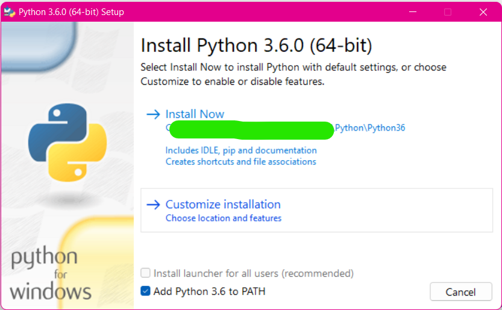

Let's say you're working on multiple projects that each use a different version of python ...

Or maybe you are working through a training or course that requires a different version than you currently have on your machine ...

Whatever the reason, it is highly likely that you will need to understand how to utilize multiple versions on your own PC. While it's important to follow the process in [virtualenvs.md](virtualenvs.md) or to review [VirtualEnvironments.md](../Tools/VirtualEnvironments.md) ... I have not yet created one on installing multiple python versions.

So here it is.

I'm going to use specific versions for this walkthrough, but the process should be the same. Regardless of the python version you're looking to add.

I already have a 3.9 and 3.10 version of python, but for following along in [this TDD book](https://amzn.to/3BPIXty) I really needed a [python 3.6 version](https://amzn.to/3BPIXty). You can find any release at [python.org/downloads](https://www.python.org/downloads/).

Be sure to install for all and that it is added to your PATH.

</img>

If not, please review [SetEnvVars](https://www.python.org/downloads/).

So let's say you had python 3.6 and 3.10 versions. Did you know you could call them by `python36` and `python310` respectively?

If you followed the above correctly, then the next phase would be:
1. In the main folder of the version, copy the `python.exe` file
2. Rename it to `python36.exe` (or whatever version)

That's it! You can now call it by that new name to start an interpreter with the version ...

Or for creation of a [new virtual environment](virtualenvs.md).