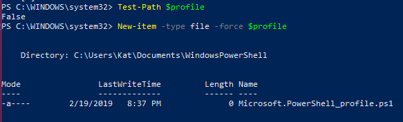

<a href='https://www.learntocodeonline.com/'></a>

Sometimes you will come across error messages like:

`ERROR: set environment variable PROJECT_HOME to the directory where projects are stored.`

This means you need to set up your environment variables.

[Here](http://www.zaxrosenberg.com/python-virtual-environments-on-windows/) is an INCREDIBLE step by step (and why) article on doing this.

# PowerShell Environment Variables

After creating your profile in Windows PowerShell, it should look something like this:

</img>

As you can see, the output shows the path of the PowerShell directory.
Usually:  `Users\USERNAME\Documents\WindowsPowerShell`

I decided not to go further on this portion as it is laid out very well in the doc I gave.

That and I had to do something different.

# What I Had To Do To Get Environment Variables To Work

Whenever I tried to run `mkproject PROJECTNAME` I kept receiving this error message:

`ERROR: set environment variable PROJECT_HOME to the directory where projects are stored.`

Here is the process I had to do in order to make it work.

1. I added the following to my `.bash_profile` file in my home directory:
   ```
   # environment setup for python
   # export WORKON_HOME="C:/Users/Kat/.virtualenvs"
   export WORKON_HOME="~/.virtualenvs"
   export PROJECT_HOME="$HOME/Documents/Programming/workspace"
   source ~/usr/local/bin/virtualenvwrapper.sh
   ```

   Quite frankly this didn't really work either until I did number 2.

2. Windows search on *Environment Variables* should bring up your System Properties box. Click on the button **Environment Variables** and add PROJECT_HOME as one. Point it to whatever folder you are using for your projects.
